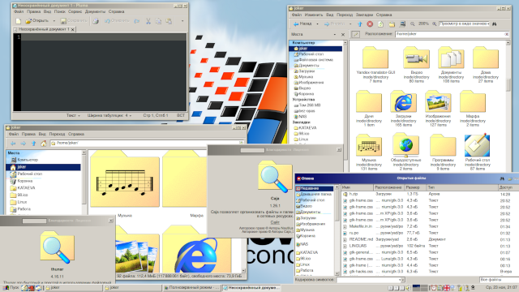

# SE98 window manager theme

Theme for xfwm4, metacity-1 and for GTK2, GTK3 widget engines.

A fork of [Redmond97](https://github.com/matthewmx86/Redmond97) Millennium theme. Sidebar clouds are added to where I could (Thunar and Open/Save dialog). In Caja they already where.